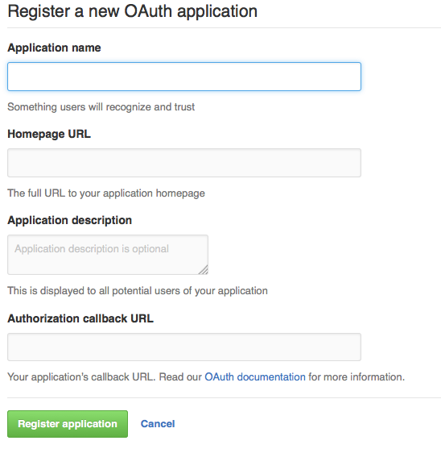
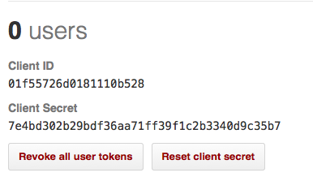

## GitHub

GitHub's OAuth integration only allows us to specify a single callback URL. This means that if you are running a wiki farm with multiple DNS roots, you will need to configure a separate application with GitHub for each wiki domain.

### Register an application with GitHub

* Log into GitHub
* Visit the Developer applications tab under OAuth applications in your Personal settings.
* Click [Register New Application](https://github.com/settings/applications/new). The *new OAuth application* configuration screen is displayed:



#### Set Application name

* Enter a name related to your wiki server.

#### Set Homepage URL

* Enter the URL of a page that describes your wiki server.

#### Set Authorization callback URL

* Enter `https://example.wiki/auth/github/callback`, replacing `example.wiki` with your wiki server root domain.

Note: If you are not ready to use HTTPS yet, you can use `http://example.wiki/auth/github/callback`

Save your settings by clicking **Register application**. The new application's settings are shown:



This screen also allows you to adjust any settings, and add an logo.

* Record the `Client ID` and `Client Secret` for use in configuring the wiki server.

### Configure Wiki

The wiki is configured by adding the `client ID` and `client secret` to the wiki domain part of the configuration.

```JSON
{
  "farm": true,
  "security_type": "passportjs",
  "wikiDomains": {
    "example.wiki": {
      "github_clientID": "CLIENT ID",
      "github_clientSecret": "CLIENT SECRET"
    }
  }
}
```
