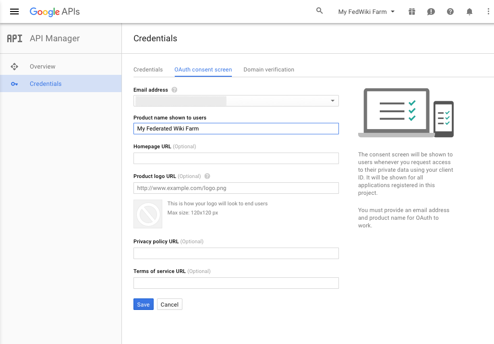
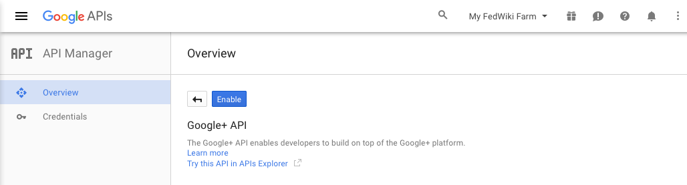
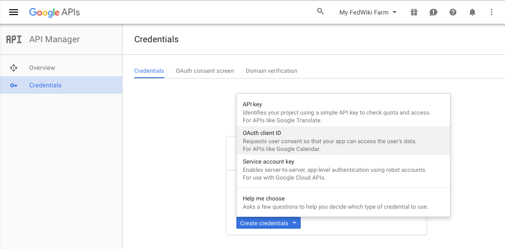
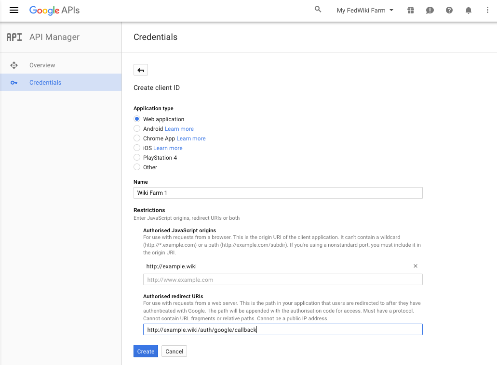
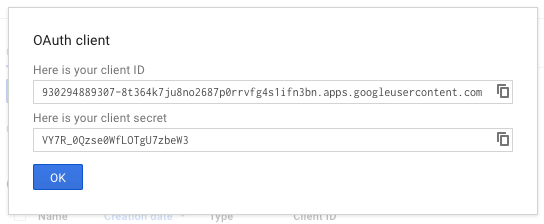

## Google

Google's OAuth integration allows us to specify multiple callback URLs, so we will only need to do this once for each wiki server.

### Register an application with Google

* While logged onto your Google account, goto the [API Manager](https://console.developers.google.com/)
* From the project dropdown at the top of the page, select **Create a project...**


* Enter a Project name, in the New Project dialog, and click **Create**

It will take a moment for Google to create your new project. Once it has been created you will receive a notification, and the page should switch to your new project. *Your new project name will appear in the project dropdown. If it does not, select your new project from the project dropdown.*

* Select **Credentials**, in the left sidebar, and then select the **OAuth consent screen** tab.

* Enter the **Product name** that will be shown to your users, when the login using Google.



* Click **Save**

* Enable the Google+ API, select **Overview** in the left nav, and choose the **Google+ API**, from the the list of Social APIs.



* Click **Enable**

* Select **Credentials**, in the left sidebar, click on **Create credentials** and select **OAuth client ID** from the pop-up list.



* Select **Web application**, and provide a name for your web application.

  * **Authorized JavaScript Origins**: `http://example.wiki`
  * **Authorized redirect URI**: `http://example.wiki/auth/google/callback`

  Replacing `example.wiki` with your wiki server root domain, also replacing `http` with `https` if you are using https *you can also enter both to support to ease migration*. If your wiki server is supporting multiple wiki domains, you can enter them as well.



* Click **Create**. Your `Client ID` and `Client Secret` will be displayed, save these to use to configure your wiki in the next step.



### Configure Wiki

The wiki is configured by adding the `client ID` and `client secret` to the configuration. They need not be added inside the `wikiDomains` definition, as the OAuth can have multiple callbacks defined, we still need the domain definition so that the wiki security plugin can understand what is required.

```JSON
{
  "farm": true,
  "security_type": "passportjs",
  "google_clientID": "CLIENT ID",
  "google_clientSecret": "CLIENT SECRET",
  "wikiDomains": {
    "example.wiki": {}
  }
}
```
