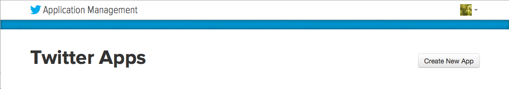
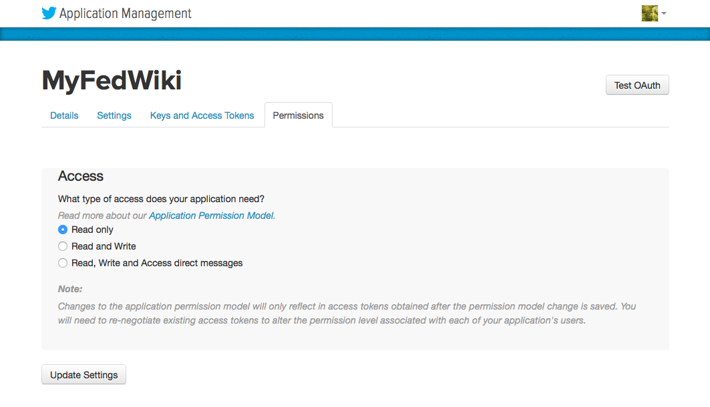
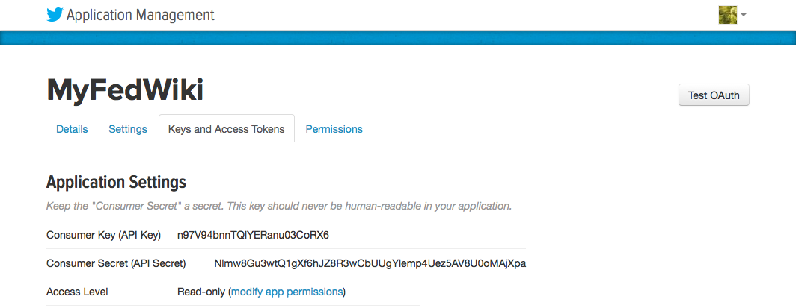

## Twitter


### Register an application with Twitter

* Login to [Twitter Application Management](https://apps.twitter.com/).
* Create a new Twitter App, by clicking on **Create New App**.

* Provide your application details. The **Callback URL** should be set with a place holder, for example `https://example.wiki/auth/twitter/callback`.

* Agree to the *Developer Agreement* and click **Create your Twitter application**.
* Once the app has been created, go to the **Settings** tab and check that the **Allow this application to be used to Sign in with Twitter** option is selected.
  * If you are only protecting a single wiki domain you can **Enable Callback Locking**.
  * You can also change the **Application Icon**.
  * If you have changed anything press **Update Settings**.
* Next go to the **Permissions** tab, change *Access* to *Read only*, and **Update Settings**

* Your application's **Consumer Key** and **Consumer Secret** will be displayed on the **Keys and Access Tokens** tab.



### Configure Wiki

The Wiki is configured by adding the `Consumer Key` and `Consumer Secret` to the configuration. As long as we have not selected `Enable Callback Locking` these can be added outside the `wikiDomains` definition, so they apply to the entire farm. The `wikiDomains` definition is required so that the security plugin knows what is required.

```JSON
{
  "farm": true,
  "security_type": "passportjs",
  "twitter_consumerKey": "CLIENT ID",
  "twitter_consumerSecret": "CLIENT SECRET",
  "wikiDomains": {
    "example.wiki": {}
  }
}
```
